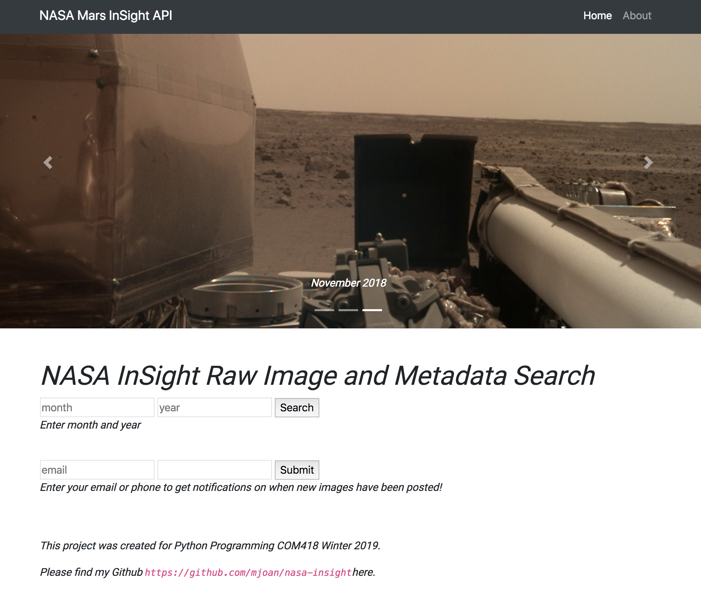
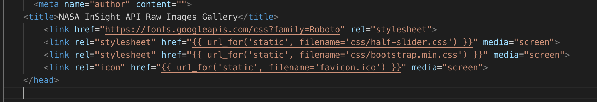

# NASA-InSight

Python Flask Bootstrap UI for Mars InSight Raw Images from NASA's API. _Check out my demo here: https://nasa-insight-api.herokuapp.com/_

## Getting Started

The details below will get this project up and running on your local machine for development. See deployment for notes on how to deploy the project on Heroku.

### Folder Structure, Syntax and Setup

Understanding how Flask is setup is important when getting started and requires a `/templates` and `/static` folder for your `html` and `css` respectively. Your `html` will need to include specific Flask syntax in order for the python template engine called, `jinja2` to render the page. Below is an example of the `jinja2` syntax using a `{{ url_for }}` to obtain your folders for stylesheets.

Starting with `app.py` you'll see all imports and libraries used to get started. I created a class for user notifications which included validation with `WTForms`. Each route is to display `/images`, confirm `/sms`, and `/email`. The most important route for `/images` is a request to the `InSightAPI` for all images. Next feature will include a search option to search by date. The `model.py` was for my `SQLite3` database setup however, I will be moving to Postgres as Heroku doesn't fully support SQLite3. 

## Deployment

This application is deployed on [Heroku](https://devcenter.heroku.com/categories/python-support) which required a [Procfile](https://devcenter.heroku.com/articles/procfile) and [runtime.txt](https://devcenter.heroku.com/articles/python-runtimes) file. I used a `.env` file for my Twilio API keys and utilized `os.environ.get` in my code for retrieval. 

## Built With
* [InsightAPI](https://pypi.org/project/insight-api/) - Python library 
* [Flask](http://flask.pocoo.org/docs/1.0/) - Microframework
* [Bootstrap](https://getbootstrap.com/) - Styling
* [WTForms](https://wtforms.readthedocs.io/en/stable/) - Forms
* [Twilio](https://pypi.org/project/twilio/) - SMS messages to user
* [Sqlite3](https://www.sqlite.org/version3.html) - DB to store user's phone and email (moving to Postgres)

## Contributing

Please read [CONTRIBUTING.md](https://gist.github.com/PurpleBooth/b24679402957c63ec426) for details on our code of conduct, and the process for submitting pull requests to us.

## Versioning

I plan on implementing versioning when I deploy next features after DB is setup. 

## Authors

* **Mariam Joan** - *Initial setup* - [MJOAN](https://github.com/MJOAN)

## License

This project is licensed under the MIT License - see the [LICENSE.md](LICENSE.md) file for details

## Acknowledgments

* [Konrad](https://pypi.org/user/konraditurbe/) Iturbe
* Dr. Huang for the UCLA Extension Python Programming class
* [NASA](https://api.nasa.gov/)for letting developers use their data 

